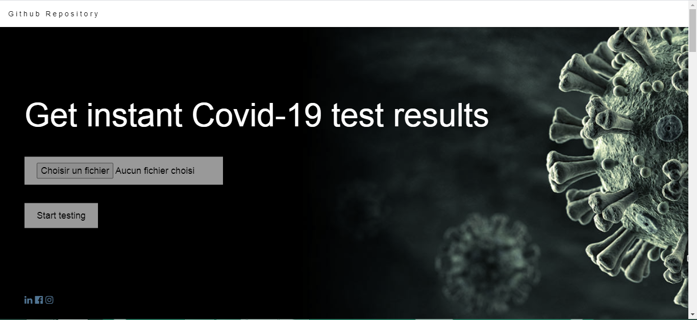
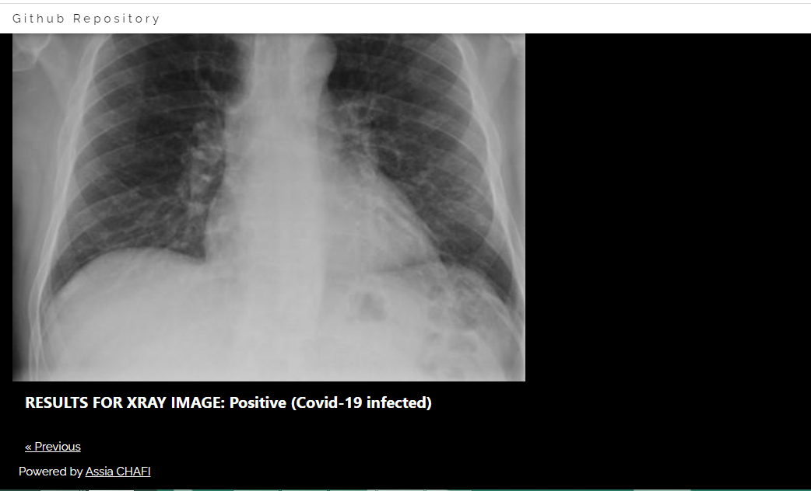

# COVID-19 detector system based on X-Ray images





---

### Table of Contents

- [Description](#Description)
- [How To Use](#how-to-use)
- [Directory Tree](#Directory-Tree)
- [Bug Feature Request](#Bug-Feature-Request)
- [Future Scope](#Future-Scope)
- [References](#references)
---

## Description

web application that provides an automated diagnosis of COVID-19 from chest X-ray image based on a deep Convolutional Neural Network model. 
the proposed model produced a classification accuracy of 98%. The preliminary results of this study look promising which can be further improved as more training data becomes available.
<br>
- Follow the link to learn more about this project: https://achafi.github.io/myportfolio/xray-covid-detection/

#### Machine Learning algorithms
- Convolutional neural network
[!CNN Architecture](cnn_archtecture.png)

#### Sources of the datasets
- [Kaggle : Chest X-Ray Images (Pneumonia) ](https://www.kaggle.com/paultimothymooney/chest-xray-pneumonia?)
- [COVID-19 image data collection](https://github.com/ieee8023/covid-chestxray-dataset)

[Back To The Top](#COVID-19-detector-system-based-on-X-Ray-images)

---

## How To Use

1. Install all the libraries mentioned in the requirements.txt file.
2. Clone this repository in your local system.
4. Open the command prompt from your project directory and run the command python app.py.

## Deployement on Heroku

Login or signup in order to create virtual app. You can either connect your github profile or download ctl to manually deploy this project.

[](https://heroku.com)

[Back To The Top](#COVID-19-detector-system-based-on-X-Ray-images)

---
## Directory Tree 
```
├── static 
│   ├── css
    ├── script.js
├── template
│   ├── home.html
|   |── image-classification-result.html
├── Procfile
├── README.md
├── app.py
├── config.cfg
├── dataSet_creator.ipynb
├── Xray_Image_Classification.ipynb
├── model.h5
├── requirements.txt
```
---
## Bug / Feature Request

If you find a bug (the website couldn't handle the query and / or gave undesired results), kindly open an [issue](https://github.com/achafi/Covid19Detector/issues) here by including your search query and the expected result

<br>

[Back To The Top](#COVID-19-detector-system-based-on-X-Ray-images)

---

## Future Scope

* Improve the model
* Optimize Flask app.py
* Add Features

<br>

[Back To The Top](#COVID-19-detector-system-based-on-X-Ray-images)
---

## References
. [CoroNet: A deep neural network for detection and diagnosis of COVID-19 from chest x-ray images](https://www.ncbi.nlm.nih.gov/pmc/articles/PMC7274128/)

<br>

[Back To The Top](#COVID-19-detector-system-based-on-X-Ray-images)