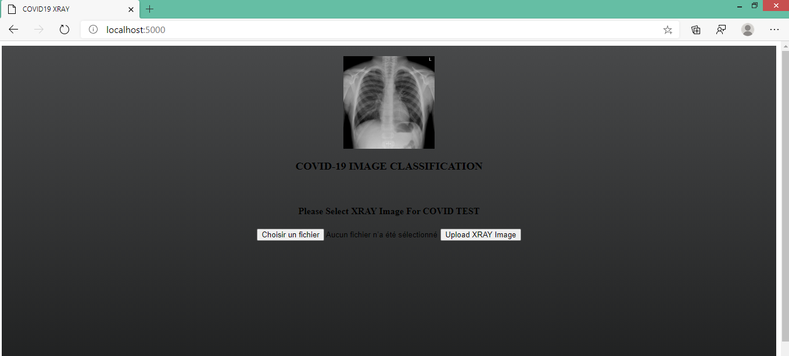

# COVID-19 detector system based on X-Ray images

---

### Table of Contents

- [Description](#description)
- [How To Use](#how-to-use)
- [References](#references)
---

## Description

web application that provides an automated diagnosis of COVID-19 from chest X-ray image. A Deep Convolutional Neural Network model to automatically detect COVID-19 infection from chest X-ray images. The proposed model is based on Xception architecture pre-trained on ImageNet dataset and trained end-to-end on a dataset prepared by collecting COVID-19 and other chest pneumonia X-ray images from two different publically available databases.
the proposed model produced a classification accuracy of 95%. The preliminary results of this study look promising which can be further improved as more training data becomes available.

Check out the live demo: ....
Link to this project report with youtube demo: https://achafi.github.io/myportfolio/xray-covid-detection/

#### Machine Learning algorithms
- Convolutional neural network

[Back To The Top](#COVID-19-detector-system-based-on-X-Ray-images)

---

## How To Use

1. Install all the libraries mentioned in the requirements.txt file.
2. Clone this repository in your local system.
4. Open the command prompt from your project directory and run the command python app.py.

#### Sources of the datasets
- [Kaggle : Chest X-Ray Images (Pneumonia) ](https://www.kaggle.com/paultimothymooney/chest-xray-pneumonia?)
- [COVID-19 image data collection](https://github.com/ieee8023/covid-chestxray-dataset)

[Back To The Top](#COVID-19-detector-system-based-on-X-Ray-images)

---

## References
. [CoroNet: A deep neural network for detection and diagnosis of COVID-19 from chest x-ray images](https://www.ncbi.nlm.nih.gov/pmc/articles/PMC7274128/)

- Website - [Assia CHAFI](https://achafi.github.io/myportfolio/)
[Back To The Top](#Movie-Recommender-System-and-Reviews-Sentiment-Analysis)